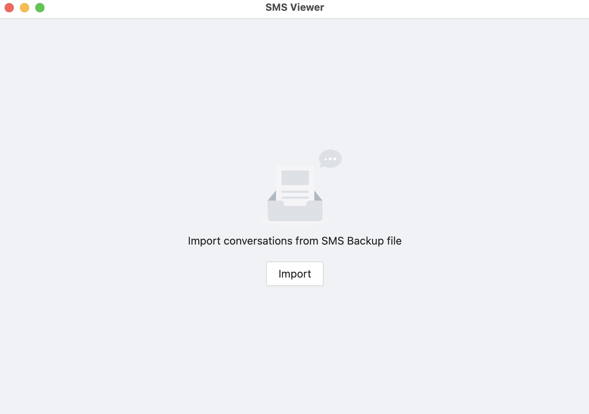
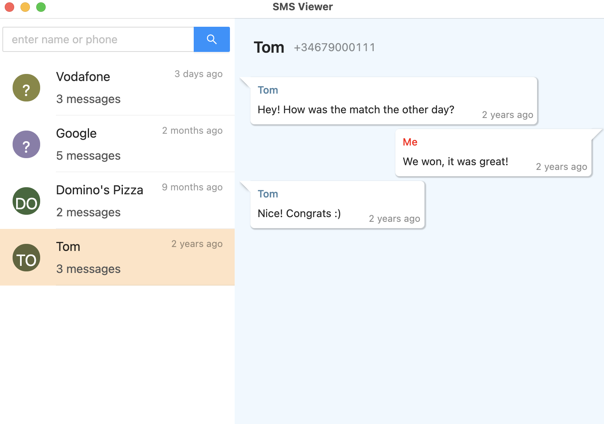

## SMS Viewer

An _Electron_ application to visualize Android SMS conversations previously exported as XML using [SMS Backup & Restore](https://play.google.com/store/apps/details?id=com.riteshsahu.SMSBackupRestore).

This project makes use of _Electron_ framework together with some popular web libraries:

- [Electron](https://www.electronjs.org/)
- [React](https://reactjs.org/)
- [React Chat Elements](https://www.npmjs.com/package/react-chat-elements)
- [Ant Design](https://ant.design/)

---

_Home screen_
 

_Chat view_
 

